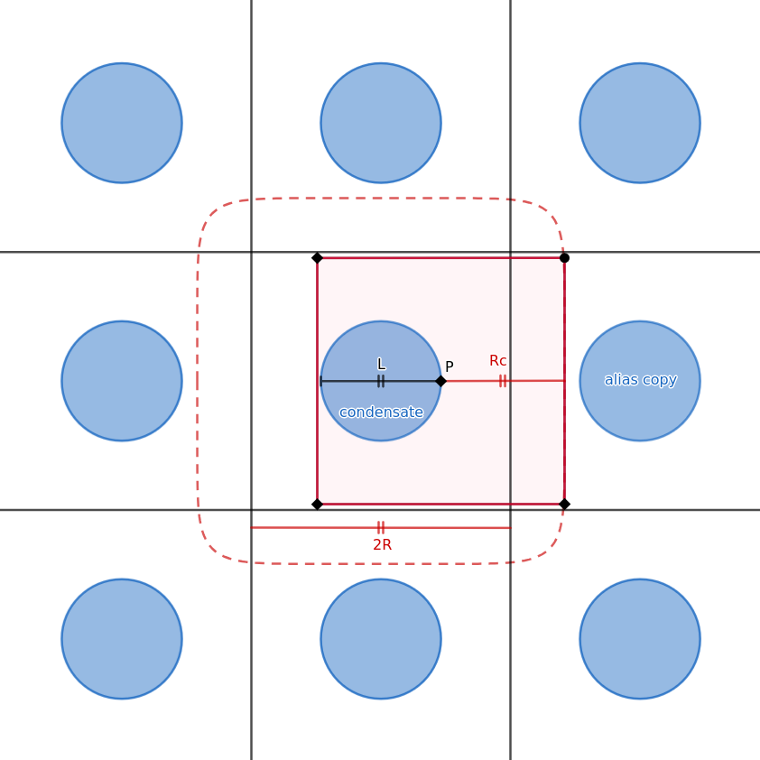

# GPU-Accelerated Simulation of Dipolar Bose-Einstein Condensates

Numerical investigation of phase transitions and finite-size effects in dipolar Bose-Einstein condensates using GPU-accelerated solutions of the three-dimensional Gross-Pitaevskii equation.

The project was developed as part of my Bachelor's thesis in Physics at Heidelberg University. It extends the **UltraCold** C++/CUDA simulation framework with custom solvers, trapping potentials, physical models, and simulation workflows for large-scale dipolar BEC calculations.

## Bachelor Thesis

The methods, numerical analysis, and physical results implemented in this repository are documented in the accompanying Bachelor's thesis:

[**Bachelor Thesis — PDF**](thesis/Bachelorarbeit_Mark_Salzmann.pdf)

## Overview

Dipolar Bose-Einstein condensates are quantum many-body systems in which long-range, anisotropic dipole-dipole interactions compete with short-range contact interactions. By varying the relative interaction strength, the condensate can undergo transitions from a superfluid state to structured droplet and supersolid phases.

This project investigates these phase transitions by numerically solving the three-dimensional Gross-Pitaevskii equation for a dipolar condensate of $(^{164}\mathrm{Dy})$ atoms. Ground-state configurations are obtained through energy minimization on a three-dimensional spatial grid, with simulations involving approximately $(10^5)$ to $(5\times10^5)$ atoms.

A particular focus of the project is the effect of **periodic boundary conditions on long-range dipolar interactions**. Fourier-space evaluation of the dipolar interaction using Fast Fourier Transforms introduces periodic replicas of the simulated system. Because the dipolar interaction is long-ranged, these replicas can interact with the physical condensate and produce unphysical numerical effects. An interaction cutoff is therefore implemented to suppress these periodic-image interactions.

The simulations compare ground states obtained with and without the cutoff across different trapping potentials and interaction regimes. The results demonstrate that periodic-image interactions can qualitatively modify the computed ground states, including droplet configurations, edge behavior, critical interaction strengths, and rotational symmetry.
# Numerical Methods in the Bachelor Thesis

## 1. Energy functional and the extended Gross-Pitaevskii equation

The starting point of the numerical treatment is the effective energy functional for a dipolar Bose gas, which contains the kinetic energy, the dipolar interaction, and the renormalized local effective potential:

$$
E[\psi, \psi^*] = \int d^3x \left[\frac{\hbar^2}{2m} |\nabla\psi|^2 + \int d^3y\, V_{dd}(\mathbf{x}-\mathbf{y}) |\psi(\mathbf{x})|^2 |\psi(\mathbf{y})|^2 + V_{\text{eff}}(\psi) \right],
$$

with

$$
V_{\text{eff}}(\psi) = (V_{\text{ext}} - \mu)|\psi|^2 + \frac{1}{2} g_R |\psi|^4 + \frac{16}{15\pi^2} g\sqrt{a_s^3}\, \mathcal{Q}_5(\varepsilon_{dd}) |\psi|^{5/2}.
$$

The ground state is obtained by minimizing the functional $E - \mu N$, where the total particle number is

$$
N = \|\psi(\mathbf{r})\|^2 = \int d^3r\, |\psi(\mathbf{r})|^2.
$$

Requiring stationarity with respect to the complex conjugate field gives the time-independent extended Gross-Pitaevskii equation (eGPE):

$$
\frac{\delta}{\delta \psi^*(\mathbf{x})} \left(E[\psi, \psi^*] - \mu N\right) = 0,
$$

which leads to

$$
\mu \psi(\mathbf{r}) = \left[-\frac{\hbar^2}{2m}\nabla^2 + V_{\text{ext}}(\mathbf{r}) + g_R |\psi(\mathbf{r})|^2 + \gamma(\varepsilon_{dd}) |\psi(\mathbf{r})|^3 + \Phi_{dd}(\mathbf{r})|\psi|^2 \right] \psi(\mathbf{r})
\equiv \mathcal{H}\psi(\mathbf{r}).
$$

The LHY correction enters as

$$
\gamma(\varepsilon_{dd}) = \frac{2}{3\pi^2} \left(\frac{m}{\hbar^2}\right)^{3/2} g_R^{5/2} \mathcal{Q}_5(\varepsilon_{dd})
= \frac{64\sqrt{\pi}\,\hbar^2 a_s^{5/2}}{3m} \mathcal{Q}_5(\varepsilon_{dd}).
$$

The corresponding time-dependent eGPE is

$$
 i\hbar \partial_t \psi(\mathbf{r}) = \left[-\frac{\hbar^2}{2m}\nabla^2 + V_{\text{ext}}(\mathbf{r}) + g_R |\psi(\mathbf{r})|^2 + \gamma(\varepsilon_{dd}) |\psi(\mathbf{r})|^3 + \Phi_{dd}(\mathbf{r})|\psi|^2 \right] \psi(\mathbf{r}).
$$

---

## 2. Dimensionless form of the eGPE

For numerical work it is useful to rewrite the equations in dimensionless units using the harmonic oscillator length and time scale:

$$
 a_{\text{ho}} = \sqrt{\frac{\hbar}{m\omega_{\text{ho}}}},
\qquad
\omega_{\text{ho}} = \frac{\hbar}{m a_{\text{ho}}^2},
$$

where

$$
\omega_{\text{ho}} = (\omega_x \omega_y \omega_z)^{1/3}.
$$

The dimensionless variables are

$$
\tilde{r}_i = \frac{r_i}{a_{\text{ho}}},
\qquad
\tilde{t} = \omega_{\text{ho}} t,
\qquad
\tilde{\omega}_i = \frac{\omega_i}{\omega_{\text{ho}}},
\qquad
\tilde{\psi}(\tilde{\mathbf{r}}) = a_{\text{ho}}^{3/2}\psi(\mathbf{r}),
\qquad
\tilde{a}_s = \frac{a_s}{a_{\text{ho}}}.
$$

In these units the time-dependent eGPE becomes:

$$
 i\partial_{\tilde{t}}\tilde{\psi}(\tilde{\mathbf{r}})
= \left[-\frac{1}{2}\tilde{\nabla}^2 + \tilde{V}_{\text{ext}}(\tilde{\mathbf{r}}) + 4\pi \tilde{a}_s |\tilde{\psi}(\tilde{\mathbf{r}})|^2 + \frac{64\sqrt{\pi} a_s^{5/2}}{3}|\tilde{\psi}(\tilde{\mathbf{r}})|^3 \mathcal{Q}_5(\varepsilon_{dd}) + \tilde{\Phi}_{dd}(\tilde{\mathbf{r}})|\tilde{\psi}|^2 \right]\tilde{\psi}(\tilde{\mathbf{r}}),
$$

with

$$
\tilde{V}_{\text{ext}}(\tilde{\mathbf{r}}) = \tilde{\omega}_x^2 \tilde{x}^2 + \tilde{\omega}_y^2 \tilde{y}^2 + \tilde{\omega}_z^2 \tilde{z}^2,
$$

and

$$
\tilde{\Phi}_{dd}(\tilde{\mathbf{r}}) = 3\tilde{a}_{dd}\int d^3\tilde{r}'\, \frac{1 - 3\cos^2\theta}{|\tilde{\mathbf{r}} - \tilde{\mathbf{r}}'|^3}|\tilde{\psi}(\tilde{\mathbf{r}}')|^2.
$$

From then on, the tildes are suppressed and all variables are treated as dimensionless.

---

## 3. Gradient descent method for the ground state

The ground state is obtained by minimizing the energy functional under the constraint of fixed particle number. The stationary solutions have the form

$$
\psi(\mathbf{r}, t) = \psi_0(\mathbf{r}) e^{-i\mu t},
$$

and satisfy the time-independent eGPE:

$$
\mathcal{H}\psi_0(\mathbf{r}) = \mu\psi_0(\mathbf{r}).
$$

The algorithm starts from an initial field $\psi_0(\mathbf{r})$, typically sampled from a uniform distribution and normalized to the target particle number $N$. A sequence of states $\{\psi_n\}_{n\in\mathbb{N}}$ is generated iteratively via steepest descent:

$$
\psi_{n+1} = \psi_n + \alpha \chi_n,
$$

where $\alpha$ is the step size and the descent direction is

$$
\chi_n = -\frac{\delta E[\psi]}{\delta \psi^*(\mathbf{r})}\bigg|_{\psi = \psi_n} = -\left(\mathcal{H}[\psi_n] - \mu_n\right)\psi_n.
$$

This ensures that the energy decreases step by step:

$$
E[\psi_{n+1}] < E[\psi_n] < \cdots < E[\psi_0].
$$

The iteration is stopped when the residual becomes sufficiently small:

$$
\frac{\|\mathcal{H}[\psi_n]\psi_n - \mu_n\psi_n\|}{\|\psi\|} \le \epsilon,
$$

with

$$
\mu_n = \frac{\langle \psi_n | \mathcal{H}[\psi_n] | \psi_n \rangle}{\|\psi_n\|^2}.
$$

After every step, the wave function is renormalized to keep the particle number fixed:

$$
\psi_{n+1} \rightarrow \sqrt{\frac{N}{\|\psi_{n+1}(\mathbf{r})\|^2}}\,\psi_{n+1}.
$$

A common acceleration is the heavy-ball method, where the update reads

$$
\psi_{n+1} = \psi_n + \alpha\chi_n + \beta(\psi_n - \psi_{n-1}).
$$

This method accelerates convergence in regions of high curvature and reduces overshooting in flatter regions.

---

## 4. Operator-splitting spectral method for dynamic simulations

To simulate the time evolution after a quench, the time-dependent eGPE is solved numerically using the split-step Fourier method, also called the operator-splitting spectral method. The Hamiltonian is divided into a kinetic part and a potential part:

$$
\mathcal{H} = \underbrace{-\frac{1}{2}\nabla^2}_{\mathcal{H}_{\text{kin}}} + \underbrace{V_{\text{ext}}(\mathbf{r}) + g|\psi(\mathbf{r}, t)|^2 + \gamma(\varepsilon_{dd})|\psi(\mathbf{r}, t)|^3 + \Phi_{dd}(\mathbf{r}, t)|\psi(\mathbf{r}, t)|^2}_{\mathcal{H}'}.
$$

The evolution over a small time step $\Delta t$ is approximated by:

$$
\psi(\mathbf{r}, t + \Delta t) = e^{-i\mathcal{H}\Delta t}\psi(\mathbf{r}, t)
\approx e^{-i\mathcal{H}_{\text{kin}}\Delta t} e^{-i\mathcal{H}'\Delta t}\psi(\mathbf{r}, t),
$$

using the Baker-Campbell-Hausdorff approximation and neglecting terms of order $\mathcal{O}(\Delta t^3)$.

The algorithm proceeds as follows:

1. Propagate in real space under $\mathcal{H}'$:

   $$
   i\frac{d}{dt}\psi(\mathbf{r}, t) = \mathcal{H}'\psi(\mathbf{r}, t)
   \Rightarrow
   \psi(\mathbf{r}, t + \Delta t) = e^{-i\mathcal{H}'\Delta t}\psi(\mathbf{r}, t).
   $$

2. Fourier transform to momentum space, where the kinetic term is diagonal:

   $$
   i\frac{d}{dt}\tilde{\psi}(\mathbf{k}, t) = \frac{k^2}{2}\tilde{\psi}(\mathbf{k}, t)
   \Rightarrow
   \tilde{\psi}(\mathbf{k}, t + \Delta t) = e^{-i\frac{k^2}{2}\Delta t}\tilde{\psi}(\mathbf{k}, t).
   $$

3. Apply the inverse Fourier transform to return to real space:

   $$
   \psi(\mathbf{r}, t_{n+1}) = \mathcal{F}^{-1}[\tilde{\psi}(\mathbf{k}, t_n + \Delta t)].
   $$

This method is efficient because the kinetic term becomes diagonal in momentum space, while the local interaction terms remain simple in real space. It is unitary and approximately preserves the norm of the wave function.

---

## 5. Box cutoff for dipolar simulations

When simulating oblate traps with strong axial confinement, the condensate can be much more extended in the radial direction than in the axial one. In such cases, a full cubic grid is inefficient because it wastes many grid points in empty space. To reduce the numerical cost, a box cutoff is introduced.

The idea is to restrict the interaction of each atom to a box whose size is smaller than the full simulation domain. In practice, the dipolar interaction is truncated so that the unphysical periodic copies are removed. The resulting Fourier transform of the truncated dipolar potential is computed numerically in the simulation.

This is important because in a periodic box, the long-range dipolar interaction would otherwise interact with its own images, which introduces artificial effects. The cutoff effectively limits the interaction volume to a region around the condensate and therefore better represents the physical system.

---

## Summary

The numerical methods used in the thesis are based on the extended Gross-Pitaevskii equation, which includes contact interactions, dipolar interactions, and the Lee-Huang-Yang correction. The ground state is computed using a gradient-descent minimization scheme, while time evolution is simulated with a split-step Fourier method. For strongly anisotropic traps, a box cutoff is used to remove artificial interactions with periodic copies and improve the efficiency and physical accuracy of the simulations.


### Interaction cutoff

The dipolar interaction is long-ranged, while FFT-based calculations impose periodic boundary conditions. The resulting periodic replicas can therefore introduce spurious interactions.

The implemented cutoff addresses this by restricting the dipolar interaction to a finite spatial range while ensuring that the simulation domain is sufficiently large to prevent interactions with periodic replicas.

The effect of this numerical treatment is investigated systematically across different atom numbers, trapping potentials, and interaction strengths.

<p align="center">
  
</p>

## Computational Implementation

The project is implemented primarily in **C++ and CUDA** and builds on the [UltraCold](https://github.com/smroccuzzo/UltraCold) scientific simulation framework.

The custom simulation layer extends the underlying framework with:

* Gradient-descent ground-state solvers
* Custom trapping potentials
* Dipolar interaction models and cutoff treatment
* Simulation parameter handling
* Automated simulation workflows
* CUDA-accelerated computational routines
* Numerical analysis and convergence checks

The underlying UltraCold codebase contains more than 20,000 lines of scientific C++/CUDA code. The project involved analyzing and extending this existing framework to support the requirements of the research problem.

Large-scale simulations were performed on Heidelberg University's **EINC GPU cluster**, using CMake and Bash for compilation, job execution, and workflow automation.

## Results

The simulations demonstrate that periodic-image interactions can produce significant numerical artifacts in dipolar BEC simulations.

### Shift of the critical interaction strength

For a cylindrical box trap with radius

$R = 10.185,\mu\mathrm{m}$

and (N=10^5) atoms, the critical relative dipolar interaction strength was found to be approximately

$1.41 < \epsilon_{dd} < 1.425$

without the interaction cutoff, compared with

$1.404 < \epsilon_{dd} < 1.41$

when the cutoff was applied.

The cutoff result is closer to the previously reported value of approximately

$\epsilon_{dd}=1.40.$


<p align="center">
  
</p>

### Periodic-image effects at high atom numbers

Increasing the particle number to

$N=5\times10^5$

causes the condensate to extend closer to the boundaries of the simulation domain, making interactions with periodic replicas more pronounced.

Without the cutoff, these interactions can modify the topology of the ground-state density and lead to configurations that are absent when the cutoff is applied.

### Effect of the interaction cutoff

The interaction cutoff suppresses unphysical interactions between the
condensate and its periodic replicas. The difference becomes particularly
pronounced for large particle numbers, where the condensate extends closer
to the boundaries of the simulation domain.

<table>
  <tr>
    <td align="center">
      
      <br>
      <em>With interaction cutoff</em>
    </td>
    <tr>
    <tr>
    <td align="center">
      
      <br>
      <em>Without interaction cutoff</em>
    </td>
  </tr>
</table>

*Table 1.** Critical values of the relative dipolar interaction strength
with and without the interaction cutoff.

| Configuration | Critical range of $\epsilon_{dd}$ |
|---|---:|
| Without cutoff | $1.41 < \epsilon_{dd} < 1.425$ |
| With cutoff | $1.404 < \epsilon_{dd} < 1.41$ |

### Spurious symmetry breaking

For softened cylindrical trapping potentials, simulations without the cutoff can exhibit explicit breaking of the rotational symmetry of the trap.

For example, in the droplet regime, the number and arrangement of droplets can differ between simulations with and without the cutoff. These effects are numerical artifacts rather than consequences of the underlying rotationally symmetric trapping potential.

### Edge effects and droplet formation

The cutoff also affects the behavior of droplets near the boundary of the condensate. In some regimes, the formation of the droplet ring is delayed without the cutoff, and the resulting edge fraction differs from the cutoff calculation.

These effects demonstrate that periodic-image interactions can influence not only the phase transition itself but also the detailed structure of the resulting ground state.

### Harmonic trapping potential

For $(N=5\times10^5)$ atoms in a harmonic trap, increasing $(\epsilon_{dd})$ produces a regime in which the trap volume becomes populated by droplets.

At sufficiently large interaction strength, the droplet densities become increasingly homogeneous throughout the condensate. The simulations also reveal rotational-symmetry-breaking configurations when periodic-image interactions are not suppressed.

## Computational Scale

The simulations were performed on three-dimensional grids with physical dimensions of approximately

$44\times44\times22,\mu\mathrm{m}^3$

and particle numbers ranging from approximately

$10^5 \quad\text{to}\quad 5\times10^5.$

GPU acceleration was essential for performing the large parameter studies required to investigate convergence, phase transitions, and cutoff effects.

## Repository Structure

```text
.
├── MyHeaders/
│   ├── gradient_descent.hpp
│   ├── gradient_descent.ipp
│   ├── MyTools.hpp
│   └── ...
├── Own_program_vault/
│   ├── main_gradient_descent.cpp
│   ├── InputParser.py
│   ├── parameters.prm
│   └── analysis notebooks
├── Results/
│   └── selected simulation results
├── thesis/
│   └── Bachelorarbeit_Mark_Salzmann.pdf
├── ultracold-dipolar/
│   └── UltraCold simulation framework
└── README.md
```

The repository contains both the C++/CUDA simulation code and Python/Jupyter tools used for post-processing, data collection, and visualization.


## Dependencies

This project is built on top of [UltraCold](https://github.com/smroccuzzo/UltraCold),
a modular C++ library for studying ultracold atomic systems within
Gross-Pitaevskii theory. UltraCold provides CPU and CUDA-accelerated
solvers and numerical infrastructure used by this project.

- **UltraCold** — C++ Gross-Pitaevskii simulation library
- **CUDA** — GPU acceleration
- **cuFFT** — Fourier transforms
- **CMake** — build system
- **Python / NumPy / SciPy / Matplotlib** — data analysis and visualization

See the [UltraCold documentation](https://smroccuzzo.github.io/UltraCold/html/index.html)
for installation instructions and API documentation.

The simulations were developed and tested in a Linux/HPC environment with NVIDIA GPUs.

## Reproducibility

The simulation code depends on the UltraCold framework contained in the `ultracold-dipolar` directory.

A typical workflow consists of:

1. Building the UltraCold library and the custom simulation code with CMake.
2. Configuring the physical and numerical parameters.
3. Running the GPU-accelerated gradient-descent simulation.
4. Processing the resulting density data with the included Python/Jupyter tools.
5. Comparing converged ground states for different interaction strengths, trapping potentials, and cutoff configurations.

Detailed numerical parameters and methodological choices are documented in the accompanying thesis.

Because the simulations were designed primarily for GPU-based HPC execution, reproducing the full parameter studies requires access to a suitable NVIDIA GPU environment.

## Scientific Context

The project investigates numerical effects that arise when long-range interactions are evaluated using Fourier methods in finite simulation domains.

The central observation is that periodic boundary conditions, while computationally convenient, can introduce interactions between the physical condensate and its periodic replicas. For dipolar systems, these interactions can become sufficiently strong to alter observable properties of the numerically obtained ground state.

The results therefore highlight the importance of carefully controlling finite-size and periodic-boundary effects when performing numerical simulations of long-range interacting quantum systems.

## References

**Bachelor thesis**

M. Salzmann, *[Title of Bachelor's Thesis]*, Heidelberg University, 2025.

See [`thesis/Bachelorarbeit_Mark_Salzmann.pdf`](thesis/Bachelorarbeit_Mark_Salzmann.pdf).

**Relevant literature**

S. M. Roccuzzo et al., study of supersolid phases in dipolar Bose-Einstein condensates.

Additional references and the complete bibliography are provided in the accompanying thesis.
